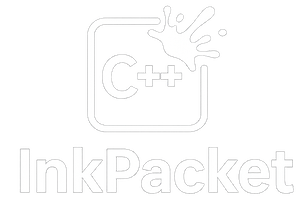

<div align="center">
  

A sophisticated binary protection system that creates self-decrypting executables with anti-tampering capabilities.
</div>

## Overview

InkPacket is a security-focused library and toolset for protecting binary executables and shared libraries. It works by embedding encrypted payloads directly into executables, which can then decrypt and load themselves at runtime using a hash-based key derivation system.

### Key Features

- **Self-Decrypting Binaries**: Executables that contain encrypted code which decrypts itself at runtime
- **Hash-as-Salt Protection**: Uses the binary's own hash as salt for key derivation, ensuring any modification breaks decryption
- **Multiple Encryption Algorithms**: Supports AES-256-GCM and ChaCha20-Poly1305
- **Anti-Debugging Protection**: Optional anti-debugging and anti-tampering mechanisms
- **Cross-Platform**: Works on Linux, macOS, and Windows
- **Zero Dependencies at Runtime**: Protected binaries are self-contained

## Installation

### Prerequisites

- CMake 3.16 or higher
- C++23 compatible compiler (GCC 11+, Clang 14+, MSVC 2022+)
- Git (for submodules)

### Building from Source

```bash
# Clone the repository
git clone https://github.com/yourusername/inkpacket.git
cd inkpacket

# Initialize submodules
git submodule update --init --recursive

# Create build directory
mkdir build && cd build

# Configure
cmake ..

# Build
make -j$(nproc)
```

This will build:
- `libinkpacket.a` - Static library for integration into your projects
- `ink-pack` - Command-line tool for creating protected binaries
- `ink-patch` - Tool for patching existing binaries with encrypted payloads

## Usage

### Basic Example: Protecting a Binary

1. **Create your application** that loads the protected payload:

```cpp
#include <ink_packet.hpp>
#include <iostream>

int main() {
    // Initialize the loader
    ink::InkPacketLoader loader;
    
    // Verify integrity
    if (!loader.verify()) {
        std::cerr << "Integrity check failed!" << std::endl;
        return 1;
    }
    
    // Load the encrypted payload
    if (!loader.load()) {
        std::cerr << "Failed to load payload: " << loader.get_error() << std::endl;
        return 1;
    }
    
    // Get function from decrypted library
    auto secret_func = loader.get_function<void(*)()>("secret_function");
    if (secret_func) {
        secret_func();
    }
    
    return 0;
}
```

2. **Create your protected library**:

```cpp
// secret_lib.cpp
#include <iostream>

extern "C" void secret_function() {
    std::cout << "This code was encrypted!" << std::endl;
}
```

3. **Build and protect**:

```bash
# Compile your main application
g++ -std=c++23 main.cpp -linkpacket -o protected_app

# Compile your secret library
g++ -std=c++23 -shared -fPIC secret_lib.cpp -o secret_lib.so

# Patch the application with the encrypted library
./ink-patch --binary protected_app --payload secret_lib.so --key "your-secret-key"
```

### Using the Builder API

For more control, use the C++ API directly:

```cpp
#include <ink_packet.hpp>

int main() {
    ink::InkPacketBuilder::Config config;
    config.output_path = "protected_app";
    config.main_source = "main.cpp";
    config.critical_sources = {"secret_lib.cpp"};
    config.enc_algo = 0; // AES-256-GCM
    
    ink::InkPacketBuilder builder(config);
    if (!builder.build()) {
        std::cerr << "Build failed: " << builder.get_error() << std::endl;
        return 1;
    }
    
    return 0;
}
```

### Protection Flags

InkPacket supports various protection mechanisms:

```cpp
using namespace ink;

// Enable anti-debugging
flags |= ProtectionFlags::ANTI_DEBUG;

// Enable multiple hash verification points
flags |= ProtectionFlags::MULTI_HASH;

// Add obfuscation layers
flags |= ProtectionFlags::OBFUSCATE;
```

## How It Works

### Architecture

InkPacket uses a novel approach to binary protection based on self-referential hashing:

1. **Binary Layout**:
   ```
   [Application Code] [Embedded Size] [Metadata] [Encrypted Payload]
   ```

2. **Protection Process**:
   - The application binary is compiled with a size placeholder
   - After compilation, `ink-patch` calculates the final binary size
   - The binary's hash becomes the salt for key derivation
   - The payload is encrypted using the derived key
   - Everything is appended to the original binary

3. **Runtime Decryption**:
   - The application reads its own embedded size value
   - It hashes exactly that many bytes of itself
   - Uses the hash with HKDF to derive the decryption key
   - Decrypts and loads the payload into memory

### Security Model

The security relies on several principles:

- **Integrity Through Hashing**: Any modification to the binary changes its hash, breaking decryption
- **No Embedded Keys**: The decryption key is derived from the binary itself
- **Memory Protection**: Decrypted code is loaded into protected memory regions
- **Anti-Analysis**: Optional anti-debugging and obfuscation features

### Encryption Details

InkPacket supports two authenticated encryption modes:

- **AES-256-GCM**: Hardware-accelerated on modern CPUs
- **ChaCha20-Poly1305**: Efficient software implementation

Both provide authenticated encryption with associated data (AEAD).

## API Reference

### Core Classes

#### `InkPacketLoader`
Runtime loader for protected binaries.

```cpp
class InkPacketLoader {
    bool verify() const;                    // Verify binary integrity
    bool load();                            // Decrypt and load payload
    void* get_symbol(const std::string&);   // Get symbol from payload
    template<typename T> T get_function();  // Get typed function pointer
};
```

#### `InkPacketBuilder`
Build system for creating protected binaries.

```cpp
struct Config {
    std::string output_path;
    std::string main_source;
    std::vector<std::string> critical_sources;
    uint8_t enc_algo;  // 0=AES-GCM, 1=ChaCha20
};
```

#### `InkPacketPatcher`
Post-build patcher for existing binaries.

```cpp
struct PatchConfig {
    std::string binary_path;
    std::string payload_path;
    std::string base_key;
    uint8_t enc_algo;
};
```

### Utility Namespaces

#### `ink::verify`
Self-verification utilities.

```cpp
bool check_integrity();     // Quick integrity check
bool deep_verify();         // Thorough verification with anti-debug
bool is_debugger_present(); // Debugger detection
```

#### `ink::memory`
Memory protection utilities.

```cpp
bool lock_pages(void* addr, size_t size);      // Prevent swapping
bool mark_non_dumpable(void* addr, size_t);    // Exclude from core dumps
void* alloc_executable(size_t size);           // Allocate executable memory
```

## Examples

See the `examples/` directory for complete examples:

- `basic.cpp` - Minimal protection example
- `crypto_demo.cpp` - Encryption/decryption workflow
- `loader_demo.cpp` - Dynamic library loading
- `protected_app.cpp` - Full application protection
- `complete_demo.cpp` - All features demonstration

### Interactive Demo

The `demo/` directory contains a standalone demonstration that shows how InkPacket works conceptually:

```bash
cd demo
bash standalone_demo.sh
```

This demo:
- Creates a sample application
- Simulates the protection process
- Demonstrates tamper detection
- Explains the security mechanisms step-by-step

No compilation of InkPacket is required - it uses standard Unix tools to illustrate the concepts.

## Security Considerations

1. **Key Management**: The base key in `ink-patch` should be kept secret
2. **Binary Distribution**: Protected binaries should be distributed over secure channels
3. **Memory Security**: Decrypted code exists in memory and could be dumped
4. **Side Channels**: Timing attacks during decryption are possible
5. **Reverse Engineering**: Determined attackers with sufficient resources can still analyze protected binaries

## Contributing

Contributions are welcome! Please see CONTRIBUTING.md for guidelines.

## License

This project is licensed under the Apache License, Version 2.0. See [LICENSE](LICENSE) for details.

## Dependencies

- [psyfer](https://github.com/joshmorgan1000/psyfer) - Cryptographic library (included as submodule)
- [goldenhash](https://github.com/joshmorgan1000/goldenhash) - Hash algorithm (via psyfer)

## Acknowledgments

This project uses the psyfer encryption library for all cryptographic operations.